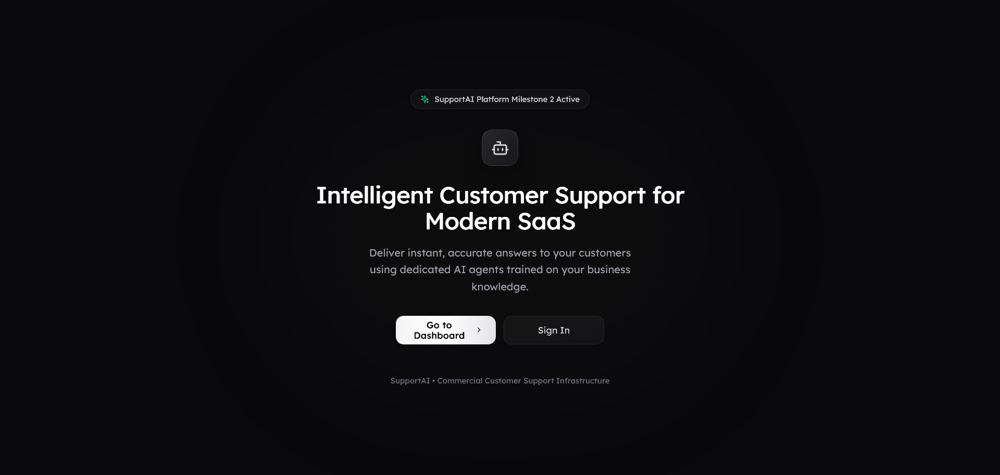
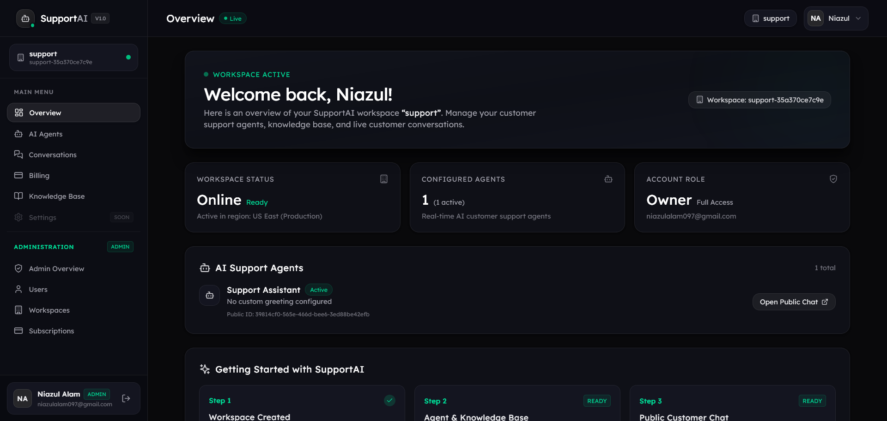
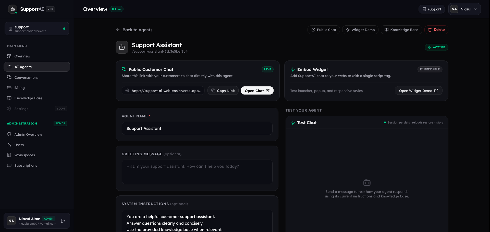
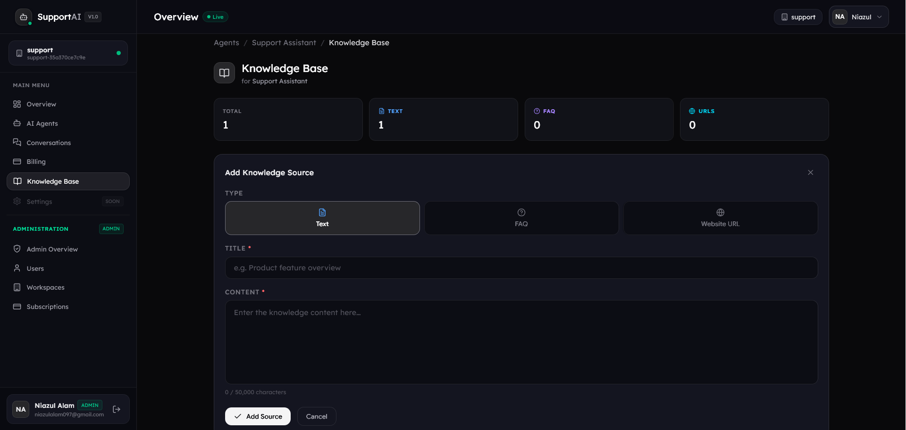
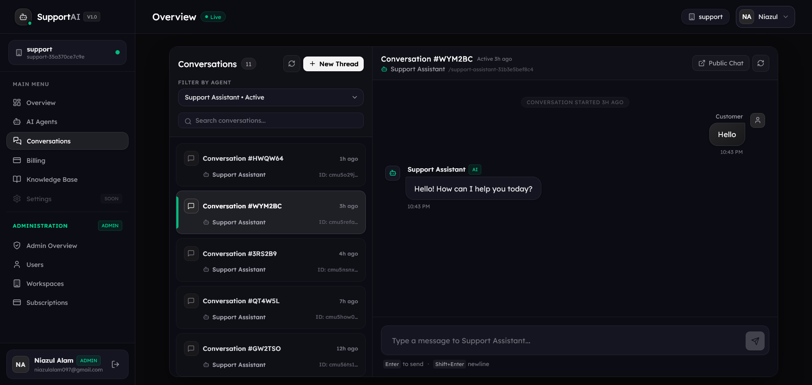
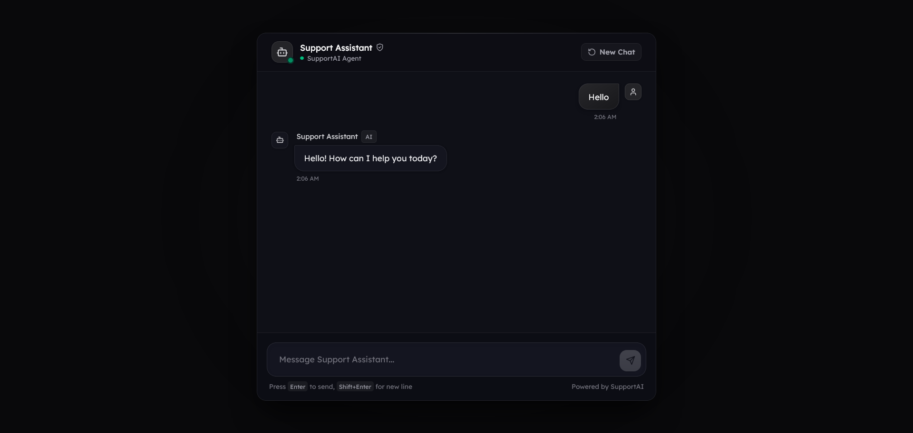
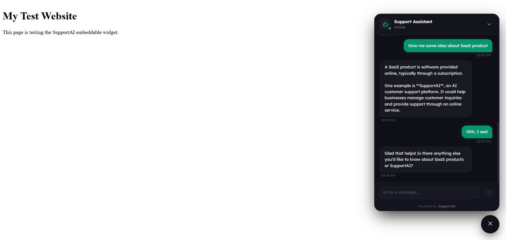
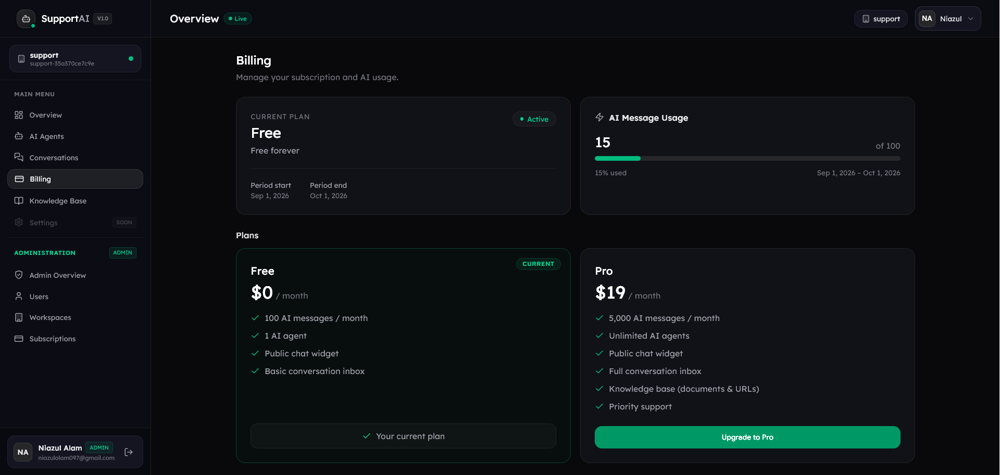
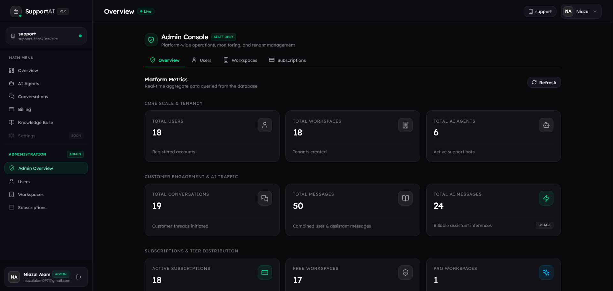

# SupportAI

SupportAI is a production-grade, multi-tenant AI customer support SaaS platform. It enables businesses to create autonomous AI support agents, train them on custom knowledge sources (documentation, FAQs, and web links), test them privately, manage live customer conversations, and deploy customer-facing support through a dedicated chat portal or an embeddable website widget.

> **AI-powered customer support SaaS built with Next.js, NestJS, PostgreSQL, Prisma, and OpenAI.**

---

## Overview

Modern customer support requires 24/7 responsiveness without ballooning operational costs. SupportAI bridges this gap by providing an end-to-end platform for configuring, training, and deploying AI support agents tailored to specific business domains.

### Primary Workflow

```text
Workspace Setup ──▶ AI Agent Creation ──▶ Knowledge Ingestion ──▶ Private Testing ──▶ Public Chat & Widget Deployment
```

1. **Workspace Setup**: Businesses register an organization workspace with role-based access control and plan-based AI usage quotas.
2. **Agent Creation**: Operators create specialized AI agents configured with custom personas and operational guidelines.
3. **Knowledge Ingestion**: Operators connect knowledge sources—raw text manuals, structured FAQs, or website URLs.
4. **Private Testing**: Teams validate agent responses and prompt constraints in an internal playground before publishing.
5. **Customer Deployment**: Customers interact with the agent via a standalone public chat URL (`/chat/[publicId]`) or through a zero-dependency, Shadow DOM-isolated embeddable JavaScript widget on any external website.

---

## Screenshots

### Landing & Dashboard

| Landing Page | Dashboard Overview |
| :---: | :---: |
|  |  |

### Agent & Knowledge Management

| Agent Details & Configuration | Knowledge Base Sources |
| :---: | :---: |
|  |  |

### Customer Support

| Conversation Inbox | Public Customer Chat |
| :---: | :---: |
|  |  |

| External Embeddable Widget |
| :---: |
|  |

### SaaS Management

| Usage & Subscription Billing | Administration Dashboard |
| :---: | :---: |
|  |  |

---

## Features

### AI Agents
- **Multi-Agent Management**: Create, update, and manage multiple AI agents within a single workspace.
- **Custom System Instructions**: Configure behavioral instructions, tone, and guardrails per agent.
- **Status Lifecycle**: Toggle agents between `Active` and `Inactive` states to control availability.
- **Private Test Chat**: Real-time internal testing panel with session persistence for evaluating agent performance before customer deployment.
- **Direct Integration Cards**: Dedicated UI actions to copy public chat links or launch the widget test harness.

### Knowledge Base & Bounded RAG
- **Structured Knowledge Types**:
  - `TEXT`: Unstructured reference guides, internal policies, and documentation.
  - `FAQ`: Question-and-answer pairs for direct query resolution.
  - `WEBSITE`: External reference URLs and web documentation sources.
- **Bounded Context Assembly**: Context builder automatically formats, filters, and bounds knowledge to 24,000 characters (max 6,000 characters per individual source) to maintain prompt deterministic safety and avoid model hallucination.
- **Prompt Injection Defense**: Strict system-level delimiters isolate knowledge context and conversation history from instructions, preventing prompt override attacks.

### Customer Conversations & Inbox
- **Operator Inbox**: Real-time listing of customer conversations with preview snippets, timestamps, and message counts.
- **Full Conversation History**: Complete multi-turn dialog inspection between customers and AI agents.
- **Public Customer Chat**: Frictionless, unauthenticated customer support interface at `/chat/[publicId]`.
- **Customer Session Isolation**: Cryptographic session tokens (`customerSessionTokenHash`) prevent cross-talk and preserve conversation history across customer page reloads.

### Embeddable Widget (`widget.js`)
- **Self-Contained Bundle**: Built into an IIFE bundle (~27 kB) using Rolldown with zero external runtime dependencies.
- **Shadow DOM Isolation**: Encapsulated CSS ensures host website styles never break the widget appearance.
- **Consistent Typography**: Self-injects the Lexend font stylesheet inside both host and Shadow DOM.
- **Session Persistence**: Persists customer conversation state in `localStorage` across page navigations and browser refreshes.
- **Configurable Attributes**: Customizable position (`bottom-right` or `bottom-left`), API base URL, and agent ID via script data attributes.
- **Interactive Test Harness**: Built-in test sandbox at `/widget-demo` with auto-configuration and lifecycle unmount cleanup.

```html
<!-- Widget Embed Snippet -->
<script
  src="https://support-ai-web-eosin.vercel.app/widget.js"
  data-agent-id="YOUR_AGENT_PUBLIC_ID"
  data-position="bottom-right">
</script>
```

### Authentication & Security
- **Dual-Token Authentication**: Short-lived JWT access tokens (15-minute expiry) paired with rotating refresh tokens (7-day expiry) stored securely in client storage.
- **Cryptographic Hashing**: Passwords and refresh tokens are salted and hashed using `bcryptjs`.
- **Role-Based Access Control (RBAC)**: Enforced via `JwtAuthGuard` and `RolesGuard` protecting administrative endpoints (`UserRole.ADMIN`).
- **Workspace Data Isolation**: All database operations verify workspace ownership to prevent cross-tenant data leakage.
- **Public Rate Limiting**: IP-based sliding window rate limiting (`PublicChatRateLimitGuard`) protects public chat and widget endpoints from denial-of-service and abuse.
- **Strict Password Validation**: Requires 12–128 characters, uppercase, lowercase, and numeric characters.

### Billing & Quota Management
- **Subscription Tiers**:
  - **FREE**: 100 AI messages / month.
  - **PRO**: 5,000 AI messages / month.
- **Atomic Usage Enforcement**: Two-phase reservation and release mechanism (`reserveAiMessage` and `releaseAiMessageReservation`) ensures quota accuracy even under concurrent requests and refunds quota if OpenAI calls fail.
- **Simulated Development Billing**: Complete checkout simulation workflow (`DevelopmentBillingProvider`) supporting upgrade, downgrade, and cancellation flows without external payment processor overhead.

### Administration Dashboard
- **Platform Analytics**: Global metrics covering total registered users, active workspaces, active subscriptions, and aggregate AI message volume.
- **User Directory**: Search, filter, and inspect users across the platform with pagination.
- **Workspace Directory**: Inspect workspaces, associated owners, and slugs.
- **Subscription Management**: Audit workspace subscription statuses (`ACTIVE`, `TRIALING`, `PAST_DUE`, `CANCELED`) with plan-type filtering.

### Account & Workspace Settings
- **Profile Management**: Update first and last name with instant UI feedback and sidebar synchronization.
- **Security & Password Changes**: Self-service password updates with real-time requirement validation; sensitive fields are cleared immediately upon submission.
- **Workspace Preferences**: Editable workspace name with auto-regenerated unique slug and read-only slug display.
- **Read-Only Email**: Account emails are guarded against unauthorized modification.

---

## Architecture

SupportAI is structured as an npm workspaces monorepo separating presentation, business logic, and database operations.

```text
support-ai/
├── apps/
│   ├── web/                    # Next.js 16 frontend & widget source
│   └── api/                    # NestJS 12 backend REST API
├── packages/
│   └── shared/                 # Monorepo shared library workspace
├── docs/
│   └── screenshots/            # Verified product screenshots
├── docker-compose.yml          # Multi-container local environment
├── Dockerfile.dev              # Base Node.js 24 image for development
├── .env.example                # Canonical environment template
└── package.json                # Root workspaces manifest
```

### Component Roles

- **`apps/web`**: Next.js 16 App Router application providing the authenticated dashboard, public customer chat portal, widget test harness, and the source/bundler configuration for `widget.js`.
- **`apps/api`**: NestJS 12 modular REST API enforcing business rules, RBAC, usage limits, authentication, and OpenAI communication.
- **PostgreSQL 16**: Relational storage managed with Prisma ORM for type-safe schema modeling and migrations.
- **OpenAI**: Powers autonomous conversational replies via the Responses API (`gpt-5.6-luna`).
- **Docker Compose**: Orchestrates PostgreSQL, API, and Web containers with persistent volume storage and automated database migrations.

---

## Tech Stack

| Category | Technology | Description |
|---|---|---|
| **Frontend Framework** | [Next.js 16](https://nextjs.org/) | App Router, Server Components, client-side rewrites |
| **UI Library** | [React 19](https://react.dev/) | React Server Components, concurrent features |
| **Styling** | [Tailwind CSS v4](https://tailwindcss.com/) | Modern utility-first CSS framework |
| **Widget Bundler** | [Rolldown](https://rolldown.rs/) | Rust-powered fast bundler generating standalone IIFE |
| **Backend Framework** | [NestJS 12](https://nestjs.com/) | Enterprise TypeScript framework with modular architecture |
| **Runtime** | [Node.js 24](https://nodejs.org/) | Modern JavaScript runtime |
| **Database & ORM** | [PostgreSQL 16](https://www.postgresql.org/) & [Prisma 7](https://www.prisma.io/) | Relational database with type-safe schema and client |
| **AI Integration** | [OpenAI SDK](https://github.com/openai/openai-node) | OpenAI Responses API (`gpt-5.6-luna`) |
| **Authentication** | [Passport JWT](http://www.passportjs.org/) & [bcryptjs](https://github.com/dcodeIO/bcrypt.js) | Dual-token authentication with salted password hashing |
| **Validation** | [class-validator](https://github.com/typestack/class-validator) & [class-transformer](https://github.com/typestack/class-transformer) | DTO input validation and payload sanitization |
| **Quality & Linting** | [ESLint 9](https://eslint.org/) & [Oxlint](https://oxc.rs/) | Fast linting and code quality validation |
| **Testing** | [Vitest 4](https://vitest.dev/) | Unit and E2E testing framework |
| **DevOps** | [Docker](https://www.docker.com/) & [Docker Compose](https://docs.docker.com/compose/) | Containerized multi-service local development |

---

## Project Structure

```text
apps/
├── web/
│   ├── public/
│   │   └── widget.js                 # Compiled embeddable widget bundle
│   └── src/
│       ├── app/
│       │   ├── (auth)/                # Login & registration routes
│       │   ├── chat/[publicId]/       # Public customer-facing chat
│       │   ├── dashboard/             # Authenticated operator dashboard
│       │   │   ├── admin/             # System administrator portal
│       │   │   ├── agents/            # Agent management & playground
│       │   │   ├── billing/           # Subscription & quota interface
│       │   │   ├── conversations/     # Live customer conversation inbox
│       │   │   ├── knowledge/         # Knowledge base navigation
│       │   │   └── settings/          # Profile, password & workspace settings
│       │   └── widget-demo/           # Widget integration testing harness
│       ├── components/                # Reusable UI components & icons
│       ├── context/                   # Client-side Auth & Session providers
│       ├── hooks/                     # Custom React hooks (useAuth)
│       ├── lib/                       # API clients & utility helpers
│       ├── types/                     # Frontend TypeScript domain types
│       └── widget/                    # Standalone widget source (DOM & API)
│
└── api/
    ├── prisma/
    │   ├── migrations/                # Database migration history
    │   └── schema.prisma              # Prisma data model definition
    └── src/
        ├── admin/                     # Admin analytics & platform management
        ├── agent-chat/                # Playground chat & context builder
        ├── agents/                    # Agent CRUD & workspace ownership
        ├── ai/                        # OpenAI provider & interface
        ├── auth/                      # JWT strategy, guards & decorators
        ├── billing/                   # Subscription plans & usage enforcement
        ├── conversations/             # Conversation & message storage
        ├── knowledge/                 # Knowledge source ingestion (Text, FAQ, URL)
        ├── public-chat/               # Rate-limited customer chat endpoints
        ├── users/                     # User profile & password management
        └── workspaces/                # Workspace tenant management
```

---

## Getting Started

### Option A — Docker Development (Recommended)

Docker Compose provisions PostgreSQL 16, automatically applies Prisma database migrations, starts the NestJS API in watch mode, and launches the Next.js development server with file watching.

#### 1. Clone the repository
```bash
git clone https://github.com/akmniazulalam/support-ai.git
cd support-ai
```

#### 2. Configure environment variables
On Windows (PowerShell):
```powershell
Copy-Item .env.example .env
```
On macOS / Linux:
```bash
cp .env.example .env
```

#### 3. Start containers
```bash
docker compose up -d --build
```

#### 4. Access services
| Service | URL | Note |
|---|---|---|
| **Web Dashboard** | `http://localhost:3000` | Next.js App Router |
| **Backend API** | `http://localhost:3001` | NestJS REST API |
| **PostgreSQL** | `localhost:5432` | User: `supportai`, DB: `supportai` |

To stop the containers:
```bash
docker compose down
```

---

### Option B — Local Node Development

#### Prerequisites
- Node.js 20+
- A running PostgreSQL 16 instance

#### 1. Install dependencies
```bash
npm ci
```

#### 2. Configure `.env`
Set `DATABASE_URL` in `apps/api/.env` pointing to your local PostgreSQL instance, along with JWT secrets and OpenAI credentials.

#### 3. Prepare Database
```bash
npm run prisma:generate --workspace=api
npm run prisma:migrate:deploy --workspace=api
```

#### 4. Build Widget
```bash
npm run build:widget --workspace=web
```

#### 5. Start Development Servers
In separate terminal windows:
```bash
# Terminal 1: Backend API (Port 3001)
npm run dev:api

# Terminal 2: Web Dashboard (Port 3000)
npm run dev:web
```

---

## Environment Variables

All configuration is managed through environment variables defined in `.env.example`.

| Variable | Description | Default / Example |
|---|---|---|
| `POSTGRES_USER` | Local PostgreSQL username | `supportai` |
| `POSTGRES_PASSWORD` | Local PostgreSQL password | `change-me` |
| `POSTGRES_DB` | Local PostgreSQL database name | `supportai` |
| `JWT_ACCESS_SECRET` | Secret key used to sign JWT access tokens | `replace-with-a-local-access-secret` |
| `JWT_REFRESH_SECRET` | Secret key used to sign JWT refresh tokens | `replace-with-a-local-refresh-secret` |
| `JWT_ACCESS_EXPIRES_IN` | Access token lifespan | `15m` |
| `JWT_REFRESH_EXPIRES_IN` | Refresh token lifespan | `7d` |
| `OPENAI_API_KEY` | OpenAI API key (leave blank for non-AI testing) | `sk-...` |
| `OPENAI_MODEL` | OpenAI model identifier | `gpt-5.6-luna` |

> **Note**: In Docker development, `BACKEND_API_URL` is configured internally in `docker-compose.yml` (`http://api:3001`) to route Next.js server-side rewrites to the API container. Never commit `.env` files containing production secrets to source control.

---

## Database Management

SupportAI uses **Prisma 7** with PostgreSQL. Schema definitions are located at `apps/api/prisma/schema.prisma`.

```bash
# Generate Prisma Client
npm run prisma:generate --workspace=api

# Apply pending migrations to database
npm run prisma:migrate:deploy --workspace=api

# Validate schema definition
npm run prisma:validate --workspace=api
```

In production, database connections connect to managed PostgreSQL instances (e.g., Supabase) with SSL connection pooling.

---

## AI & Bounded Retrieval Flow

When a customer submits a query via public chat or the widget:

```text
Customer Query
      │
      ▼
Rate Limit & Session Guard (PublicChatRateLimitGuard)
      │
      ▼
Atomic Quota Check (UsageService.reserveAiMessage)
      │
      ▼
Agent & Knowledge Fetch (KnowledgeService)
      │
      ▼
Context Assembly (KnowledgeContextBuilderService — max 24,000 chars)
      │
      ▼
OpenAI Responses API (client.responses.create with prompt delimiters)
      │
      ▼
Persist Message & Finalize Quota
(If AI fails: releaseAiMessageReservation refunds the quota)
      │
      ▼
Assistant Response to Customer
```

---

## Docker Architecture

```text
       [ Browser ]
            │
            │ :3000
            ▼
┌───────────────────────┐
│     web container     │ (Next.js with --webpack file watching)
│   BACKEND_API_URL:    │
│    http://api:3001    │
└───────────┬───────────┘
            │
            │ Docker Network: http://api:3001
            ▼
┌───────────────────────┐
│     api container     │ (NestJS in watch mode + Prisma migrations)
│     DATABASE_URL:     │
│   postgres:5432       │
└───────────┬───────────┘
            │
            │ Docker Network: postgres:5432
            ▼
┌───────────────────────┐
│  postgres container   │ (postgres:16-bookworm)
│  volume: postgres_data│
└───────────────────────┘
```

The API connects to PostgreSQL using the Docker internal service name (`postgres:5432`), and persistent storage is preserved via the named `postgres_data` volume across container rebuilds.

---

## Deployment Architecture

SupportAI is architected for decoupled cloud deployment:

- **Frontend (`apps/web`)**: Hosted on [Vercel](https://vercel.com/) (`https://support-ai-web-eosin.vercel.app`), serving Next.js pages and the compiled `widget.js` static bundle.
- **Backend (`apps/api`)**: Hosted on [Render](https://render.com/) (`https://support-ai-sihl.onrender.com`), exposing the containerized NestJS REST API.
- **Database**: Hosted on [Supabase](https://supabase.com/) PostgreSQL with connection pooling.

API requests from the frontend client are routed through Next.js rewrites (`/api/backend/:path*`), shielding direct backend hostnames from public exposure.

---

## Development Commands

| Command | Workspace | Description |
|---|---|---|
| `npm run dev:web` | Root | Starts Next.js development server |
| `npm run dev:api` | Root | Starts NestJS development server in watch mode |
| `npm run build --workspace=web` | Web | Builds `widget.js` bundle and Next.js production app |
| `npm run build:widget --workspace=web` | Web | Bundles standalone `widget.js` with Rolldown |
| `npm run lint --workspace=web` | Web | Runs ESLint on Next.js frontend code |
| `npm run build --workspace=api` | API | Builds NestJS TypeScript backend into `dist/` |
| `npm run lint --workspace=api` | API | Runs Oxlint on NestJS backend code |
| `npm run test --workspace=api` | API | Runs Vitest unit tests |
| `npm run test:e2e --workspace=api` | API | Runs Vitest end-to-end integration tests |
| `npm run prisma:generate --workspace=api` | API | Generates Prisma client types |
| `npm run prisma:migrate:deploy --workspace=api` | API | Deploys schema migrations |

---

## Security Practices

- **Zero-Secret Client Widget**: The embeddable widget interacts exclusively via public agent identifiers (`data-agent-id`); private API keys or JWT secrets are never exposed to the client.
- **Stateless Session Tokens**: Customer sessions generate hashed authorization tokens (`customerSessionTokenHash`) for tamper-proof multi-turn conversation tracking.
- **Abuse Prevention**: Public endpoints enforce IP-based rate limiting to prevent denial-of-service and unmetered OpenAI token consumption.
- **Two-Phase Quota Reservation**: AI message credits are reserved atomically before calling upstream AI services and automatically refunded if errors occur.
- **Cross-Origin Resource Sharing (CORS)**: Strict origin allowlisting configured at the NestJS gateway.

---

## Current Status

SupportAI is an operational SaaS MVP featuring:
- Complete authentication and workspace tenant management
- Multi-agent configuration and prompt customization
- Multi-source knowledge base ingestion (`TEXT`, `FAQ`, `WEBSITE`)
- Bounded RAG context generation with injection defenses
- Customer conversation inbox and live dialog viewer
- Frictionless public chat pages (`/chat/[publicId]`)
- Shadow DOM embeddable widget bundle (`widget.js`)
- Quota-metered billing tiers with development checkout flow
- Administrator analytics, user auditing, and subscription monitoring
- Comprehensive account, security, and workspace settings
- Fully containerized Docker local development workflow

---

## Future Improvements

- Production Stripe billing webhook integration
- Vector embedding storage and semantic similarity retrieval for large-scale knowledge bases
- Multi-user workspace invitations and granular team permissions
- Streaming token responses (SSE) for conversational chat interfaces
- Advanced LLM evaluation, hallucination detection, and conversation observability metrics

---

## Author

- **Author**: A.K.M. Niazul Alam
- **GitHub**: [@akmniazulalam](https://github.com/akmniazulalam)
- **Repository**: [support-ai](https://github.com/akmniazulalam/support-ai)
- **Email**: niazulalam097@gmail.com
